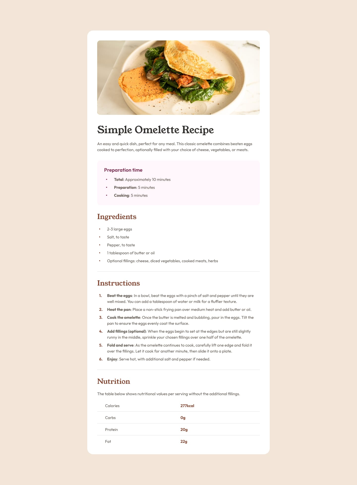
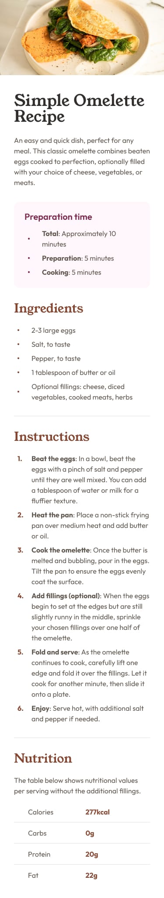
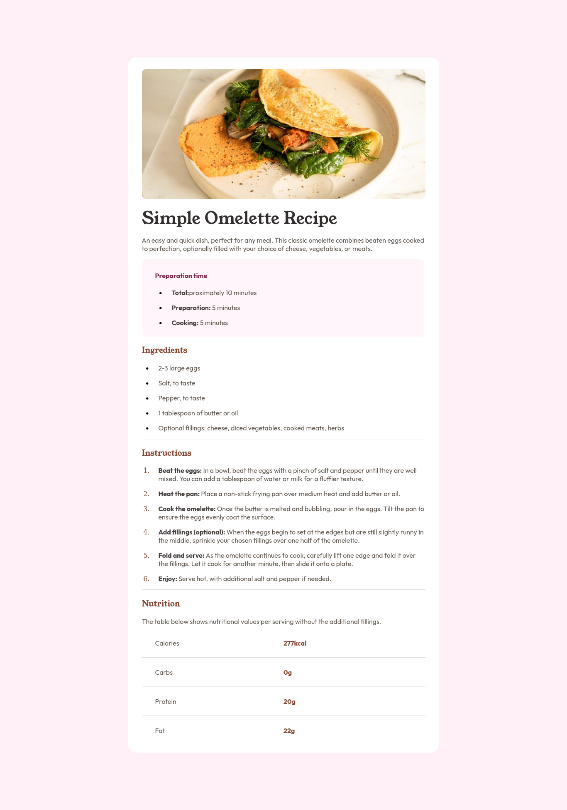
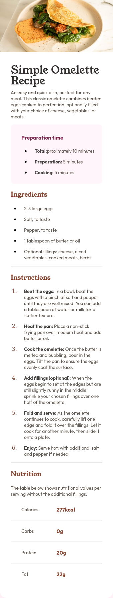

# Frontend Mentor - Recipe page solution

This is a solution to the [Recipe page challenge on Frontend Mentor](https://www.frontendmentor.io/challenges/recipe-page-KiTsR8QQKm). Frontend Mentor challenges help you improve your coding skills by building realistic projects. 

## Table of contents

- [Overview](#overview)
  - [The challenge](#the-challenge)
  - [Screenshot](#screenshot)
  - [Links](#links)
- [My process](#my-process)
  - [Built with](#built-with)
- [Author](#author)

### Screenshot

#### The challenge Screenshots
##### Desktop

##### Mobile

#### The solution Screenshots
##### Desktop

##### Mobile

### Links
- Live site URL: [Live site URL](https://rankobinu.github.io/Omelette_Recepie/)
- Solution URL: [Solution URL](https://github.com/rankobinu/Omelette_Recepie)
## My process

### Built with

- Semantic HTML5 markup
- CSS custom properties
- Flexbox

## Author

- Frontend Mentor - [@rankobinu](https://www.frontendmentor.io/profile/rankobinu)

